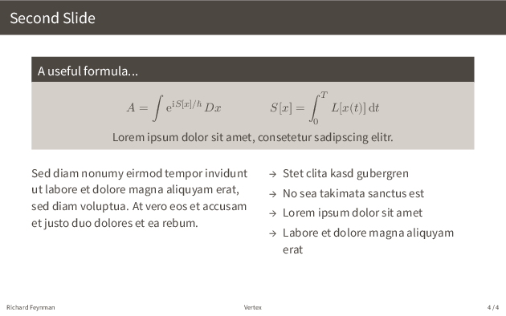

# Vertex - A theme for LaTeX-Beamer

## Theme Options

- `\usetheme[simplefootline]{vertex}` - use a simpler footline
- `\usetheme[totalframes]{vertex}` - show total number of slides

## Title page

## Formulas and column breaks

